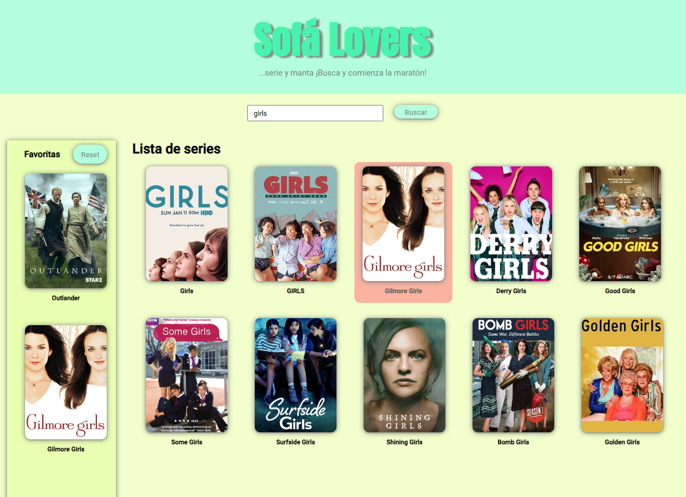

# Java Script website: Series finder website

This is my new Javascript website where you can search series and check like favorites.

## 📋 Initial Requeriments

- The website must fetch from **TVMaze API**
- Mark and unmark series as favorites
- Save the series in **Local storage**, so you never lose them.

## 🌟 Quality Requirements

- Semantic must be right.
- Responsive website.

## 🔨 Built with

- **Visual Studio Code**
- **HTML**
- **SASS** 
- **Java Script**

## 🐑🐑 Want to clone my repository?

Go for it! And if you make something pretty, please show me.
  
## ✏️ Do you have any idea? 

I'm an student and as I stated before am learning a whole lot of Front End Developing, so, if  you have any idea that I could develope please tell me so and I will try to.

## 🙍‍♀️ Autor

[)](https://github.com/crisrodriguezgar)

## 🏆 Codefactor

### Enjoy it!